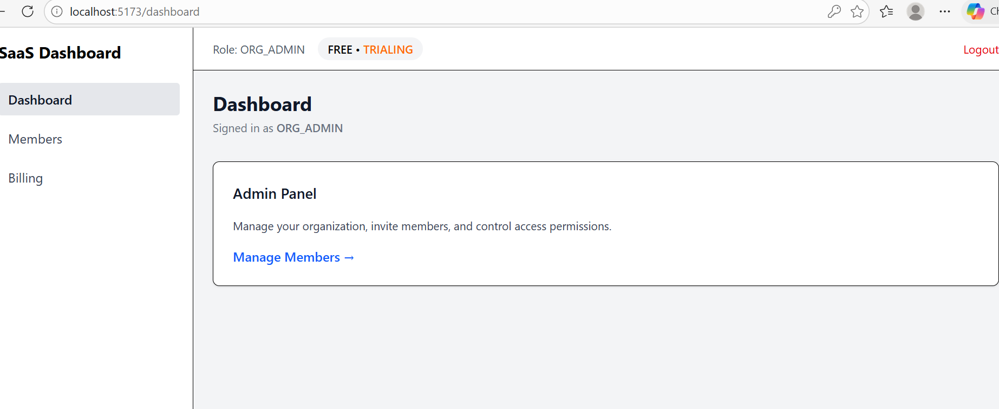
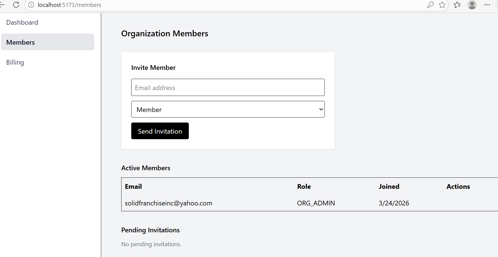
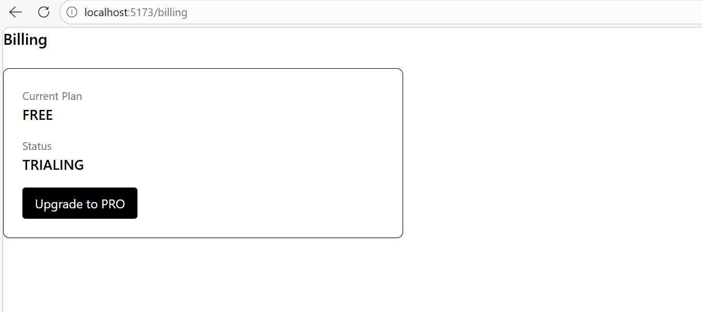
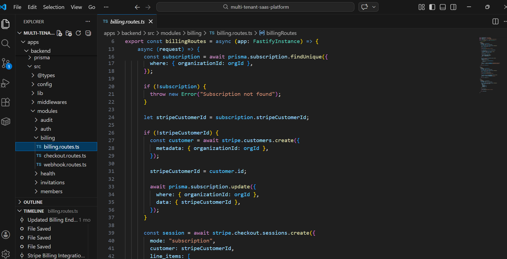

# Multi-Tenant SaaS Platform

## Overview

This project is a production-grade, multi-tenant SaaS platform built with **TypeScript, React, Node.js, PostgreSQL, and Docker.** The project represents a real-world SaaS architecture implementing the core systems required to build scalable B2B software. It includes **Tenant Isolation, Authentication, Role-Based Access Control (RBAC), Invitations, Billing (Stripe), Async jobs, and Email delivery**, structured in a way that mirrors production systems.

## Why This Project

Most portfolios showcase isolated features. This project demonstrates how real SaaS systems are engineered end-to-end, focusing on:

- System design over surface-level features  
- Correctness and safety over shortcuts  
- Real-world trade-offs in multi-tenant environments  

It answers:

- How do you safely support multiple organizations in one system?
- How do you enforce access boundaries?
- How do you handle billing without touching card data?
- How do you design for growth from day one?

## What the Platform Does

The system allows:

- Organizations to sign up and operate in isolated environments  
- Users to belong to organizations with roles (ORG_ADMIN, MEMBER)  
- Admins to invite users via secure, token-based email flows  
- Users to accept invitations and join organizations  
- Admins to manage members (invite, revoke, remove)  
- Organizations to upgrade and manage billing via Stripe  
- Subscription-aware UI and backend enforcement  

## High-Level Architecture

### Mono-repo

- **Frontend**: React + TypeScript (Vite)
- **Backend**: Node.js + TypeScript (Fastify)
- **Database**: PostgreSQL (via Prisma ORM)
- **Async Jobs**: BullMQ + Redis
- **Email Delivery**: Resend
- **Billing**: Stripe (Checkout + Customer Portal)
- **Infrastructure**: Docker (local), AWS (production-ready)

The system runs as a **single backend service** with strict tenant scoping enforced at:

- Request layer (middleware)
- Business logic
- Database queries

## Core Features Implemented

### Multi-Tenancy
- Single database, multi-tenant architecture  
- Tenant context enforced via middleware  
- No cross-organization data leakage  
- Organization-scoped queries everywhere 
- Rate limiting 

### Authentication & Identity
- JWT-based authentication  
- Secure password hashing  
- Identity includes:
  - `userId`
  - `organizationId`
  - `role`
- Persistent auth state (frontend + backend aligned)

### Role-Based Access Control (RBAC)
- Permission-based system (not hardcoded roles)
- Examples:
  - `user:invite`
  - `user:remove`
  - `billing:update`
- Middleware-level enforcement
- Role → Permission mapping

### Invitations System (Production-Grade)
- Token-based invitation flow  
- Expiring invite links (24h)  
- Email delivery via Resend  
- Accept flow with:
  - User creation (if new)
  - Membership creation
  - Audit logging  

### Organization Management
- Invite members  
- View active members  
- Revoke pending invitations  
- Remove members  
- Prevent self-removal (UI + backend enforced)  

### Billing & Subscriptions (Stripe)
- Stripe Checkout integration  
- Stripe Customer Portal integration  
- No card data handled by frontend/backend  
- Secure session-based billing  

Endpoints:
- `/billing/checkout`
- `/billing/portal`
- `/billing/current`

Frontend:
- Dynamic billing UI (Upgrade / Manage)
- Subscription-aware UX

### Subscription Awareness
- Plan: FREE / PRO  
- Status: TRIALING / ACTIVE / CANCELED  
- UI reflects subscription state  
- Foundation for feature gating  

### Async Processing (Queues)
- BullMQ + Redis for background jobs  
- Email sending offloaded from request cycle  
- Worker-based architecture  

Flow:

`Invite → Queue Job → Worker → Resend Email`

### Email System
- Resend integration  
- HTML email templates  
- Organization-branded invites  
- Tokenized acceptance links  

### Audit Logging
- All critical actions logged:
  - Invite created
  - Invite accepted
  - Member removed  
- Stored per organization  
- Designed for compliance & traceability  

### API Design
- Fastify for performance  
- Zod for validation  
- Typed request/response contracts  
- Centralized error handling  
- Clean, predictable REST structure  

### Frontend Architecture
- React + TypeScript  
- Auth context with persistent state  
- Protected routes  
- Role-based UI rendering  
- API client with automatic:
  - JWT injection  
  - Tenant header injection  

## Tech Stack

### Frontend
- React (Vite)
- TypeScript
- Axios
- Tailwind CSS

### Backend
- Node.js
- TypeScript
- Fastify
- Prisma ORM
- Zod validation

### Database
- PostgreSQL
- Transaction-safe operations
- Tenant-scoped queries

### Infrastructure
- Docker & Docker Compose
- Redis (for queues)
- AWS (ECS, RDS, S3, CloudFront)
- GitHub Actions (CI/CD ready)

### Third-Party Services
- Stripe (billing)
- Resend (email delivery)

## Running Locally

```
docker compose up --build

npm run dev
```
This starts:

- Frontend (React)
- Backend API
- PostgreSQL
- Redis (for queues)

## Sample Pictures

### Dashboard, Members, Billing:







### Local Environment:



## Repository Structure

```
multi-tenant-saas-platform/
├── .github/
├── apps/
│ ├── frontend/ # React + TypeScript frontend
│ └── backend/ # Fastify API
│ ├── prisma/ # Schema & migrations
│ ├── src/
│ │ ├── modules/ # Domain modules (auth, billing, etc.)
│ │ ├── middlewares/
│ │ ├── queues/
│ │ ├── utils/
│ │ └── config/
│ ├── Dockerfile
│ └── package.json
├── infra/ # AWS
├── docker-compose.yml
├── .gitignore
└── README.md
```

## Contact

- **Name:** Ndudi-Okehi Ndudi
- **Email:** https://github.com/endys-hub
- **LinkedIn:** https://linkedin.com/in/ndudi-okehi-813137390